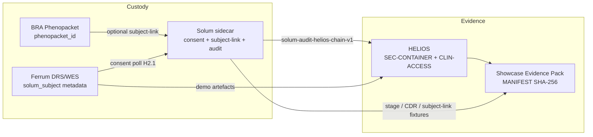

# Evidence surface (Ferrum · Solum · BRA → HELIOS → Showcase)

**Status:** 2026-08-12 · org plan **F7** (canonical diagram for evidence notes)

**Honesty:** Evidence Packs and HELIOS reports are **technical artefacts**, not certificates.

**Operator join key:** [Ferrum subject-bridge runbook](https://github.com/SynapticFour/Ferrum/blob/main/docs/solum-subject-bridge-runbook.md)
